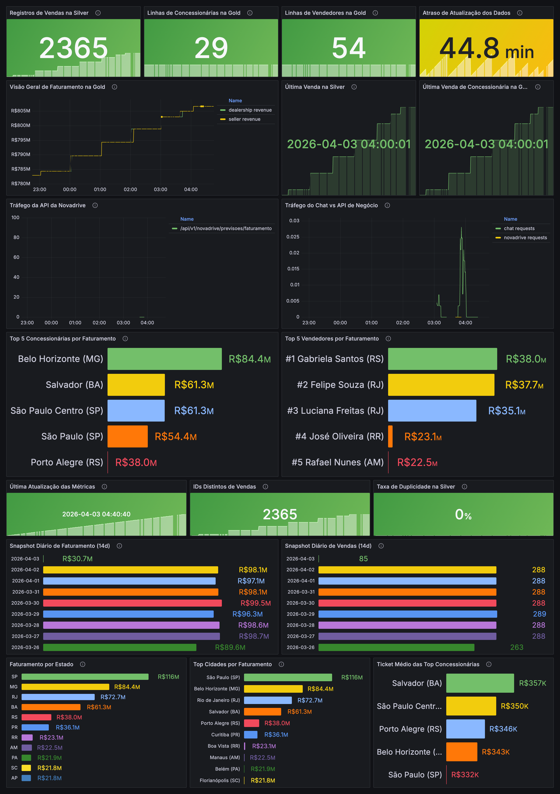
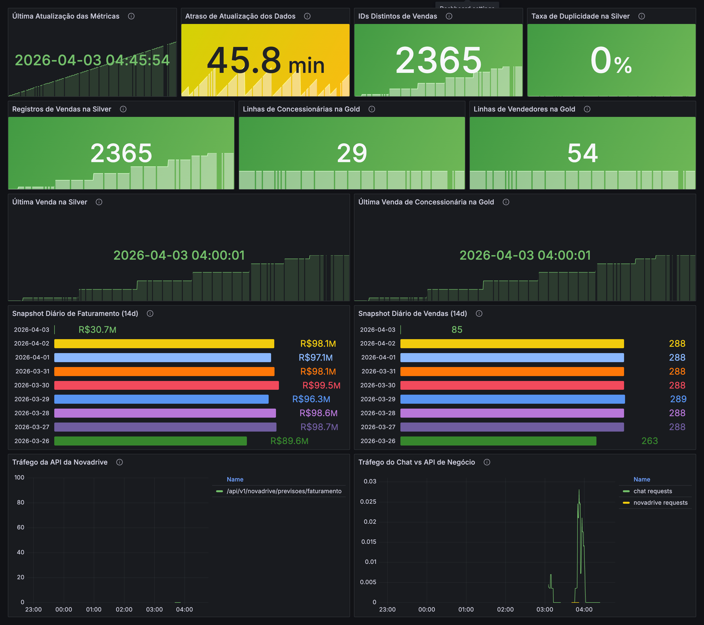

# Data Platform Copilot

O Data Platform Copilot é um assistente de metadados e operações orientado a GenAI para times que trabalham com Databricks e GCP.

Hoje o projeto já entrega um MVP funcional com:

- backend FastAPI publicado no Cloud Run
- infraestrutura GCP gerenciada com Terraform
- orquestração validada localmente com Apache Airflow via Docker
- pipeline medalhão da Novadrive em evolução com PostgreSQL, GCS e BigQuery
- CI/CD com GitHub Actions
- frontend demo em React + Vite
- observabilidade local com Prometheus + Grafana para API e orquestração
- dashboards dedicados da Novadrive para visão executiva e qualidade de dados
- descoberta real de datasets e detalhes de datasets via Databricks
- catálogo persistido de metadados ingeridos em arquivo local
- busca semântica sobre o catálogo com embeddings
- retrieval híbrido entre datasets e documentação operacional do repositório
- síntese grounded opcional com LLM quando configurado
- consultas analíticas reais da Novadrive via BigQuery Gold
- camada de ML da Novadrive com previsão diária de faturamento por concessionária via BigQuery ML
- fallback seguro para mock quando uma fonte ainda não está disponível no workspace

## Status Atual

A plataforma já está utilizável de ponta a ponta para demo e validação técnica.

Na infraestrutura `dev`, o backend e os componentes-base já estão provisionados. A solução oficial de orquestração deste projeto é o Apache Airflow local via Docker, onde a pipeline da Novadrive já foi validada ponta a ponta.

### Acessos Rápidos

Links principais do ambiente:

- API publicada: [Cloud Run API](https://data-platform-copilot-api-914371024790.us-central1.run.app)
- Endpoint publicado de chat: [Cloud Run Chat API](https://data-platform-copilot-api-914371024790.us-central1.run.app/api/v1/chat)
- Frontend demo local: [http://localhost:5173](http://localhost:5173)
- Frontend demo local alternativo: [http://localhost:4173](http://localhost:4173)
- API local: [http://127.0.0.1:8000/api/v1](http://127.0.0.1:8000/api/v1)
- Chat local via API: [http://127.0.0.1:8000/api/v1/chat](http://127.0.0.1:8000/api/v1/chat)
- Airflow local: [http://localhost:8081](http://localhost:8081)
- Grafana local: [http://localhost:3000](http://localhost:3000)
- Prometheus local: [http://localhost:9090](http://localhost:9090)
- cAdvisor local: [http://localhost:8083](http://localhost:8083)

### Backend

- `GET /api/v1/health`
- `GET /api/v1/datasets`
- `GET /api/v1/datasets/{dataset_id}`
- `GET /api/v1/search`
- `GET /api/v1/jobs`
- `GET /api/v1/jobs/{job_id}/incidents`
- `GET /api/v1/lineage/{dataset_id}`
- `GET /api/v1/novadrive/faturamento/concessionarias`
- `GET /api/v1/novadrive/faturamento/comparativo`
- `GET /api/v1/novadrive/faturamento/resumo`
- `GET /api/v1/novadrive/performance/vendedores`
- `GET /api/v1/novadrive/previsoes/faturamento`
- `POST /api/v1/metadata/sync`
- `POST /api/v1/chat`

### O que já está real hoje

- listagem de datasets via Unity Catalog
- detalhe de dataset via Unity Catalog
- colunas reais dos datasets via Unity Catalog
- datasets analíticos da Novadrive materializados em BigQuery
- detalhe e colunas de tabelas da Novadrive via metadados do BigQuery
- endpoints reais de faturamento por concessionária e performance de vendedores
- endpoint real de resumo consolidado de faturamento da Novadrive
- endpoint real de previsão de faturamento por concessionária com materialização no BigQuery
- endpoint real de comparativo histórico de faturamento da Novadrive
- chat respondendo perguntas sobre indicadores da Novadrive, incluindo faturamento atual/total e previsão
- chat respondendo perguntas históricas e comparativas, como última semana vs semana anterior
- chat respondendo perguntas sobre datasets explícitos como `samples.tpch.orders`
- chat respondendo owner e colunas de datasets reais, incluindo tabelas BigQuery da Novadrive
- chat respondendo perguntas mais amplas sobre o ambiente, incluindo consultas por owner
- chat recuperando também documentação operacional e runbooks do repositório
- catálogo persistido em `pipelines/metadata/state/`
- endpoint de busca semântica sobre datasets catalogados e documentos

### O que ainda usa fallback

- jobs usam mock quando o workspace Databricks ainda não possui jobs reais
- lineage usa mock quando o workspace Databricks não expõe uma API utilizável
- a síntese com LLM é opcional e depende de `OPENAI_API_KEY` e `OPENAI_RESPONSE_MODEL`

## Direção do Produto

A aplicação já é conversacional, mas hoje ela é melhor descrita como um copilot grounded em fase MVP, e não ainda como um assistente totalmente baseado em LLM.

Modelo atual de interação:

- consultas estruturadas em APIs
- roteamento determinístico de intenção
- respostas em linguagem natural geradas a partir de metadados grounded

Evolução desejada:

- pipelines de ingestão de metadados e documentos reais
- camadas bronze, silver e gold normalizadas
- ranking e filtros analíticos mais ricos no chat
- recuperação híbrida de metadados e documentação
- expansão da camada de copiloto para troubleshooting mais amplo

## Arquitetura de Alto Nível

- Fontes: PostgreSQL da Novadrive, Databricks Unity Catalog, Databricks Jobs, metadados operacionais, documentação interna e futuros sinais da plataforma
- Bronze: dados brutos e alinhados à origem, incluindo extrações da Novadrive em GCS e tabelas bronze no BigQuery
- Silver: entidades normalizadas e enriquecidas, incluindo a tabela `silver_novadrive.vendas`
- Gold: visões analíticas e product-facing, incluindo `gold_novadrive.faturamento_por_concessionaria` e `gold_novadrive.performance_vendedores`
- Gold/ML: features diárias, modelo preditivo e tabela de previsões de faturamento por concessionária
- Camada de produto: serviços FastAPI, frontend React, CI/CD, infraestrutura Terraform, Airflow local para operação do pipeline e futuros fluxos de RAG

## Arquitetura Medalhão

O projeto segue uma arquitetura medalhão para organizar ingestão, curadoria e consumo analítico:

- `Bronze`: preserva a fidelidade da origem e a rastreabilidade da ingestão
- `Silver`: padroniza entidades e aplica regras de negócio
- `Gold`: expõe modelos analíticos e ativos prontos para API e copiloto

Fluxo principal atual da Novadrive:

```text
PostgreSQL Novadrive
        |
        v
Extração incremental no Airflow local
        |
        v
GCS Bronze + BigQuery Bronze
        |
        v
BigQuery Silver
        |
        v
BigQuery Gold
        |
        v
FastAPI / Chat / Frontend Demo
```

Camadas e ativos principais da Novadrive:

- `bronze_novadrive`: dados brutos extraídos do PostgreSQL
- `silver_novadrive.vendas`: visão consolidada, normalizada e deduplicada de vendas
- `gold_novadrive.faturamento_por_concessionaria`: agregado analítico por concessionária
- `gold_novadrive.performance_vendedores`: agregado analítico por vendedor
- `gold_novadrive.ml_receita_diaria_concessionarias`: série diária por concessionária para treino
- `gold_novadrive.modelo_previsao_faturamento_concessionarias`: modelo `ARIMA_PLUS` treinado no BigQuery ML
- `gold_novadrive.previsao_faturamento_concessionarias`: previsões diárias materializadas

Observação importante sobre qualidade de dados:

- a modelagem da `silver_novadrive.vendas` foi ajustada para deduplicar registros de bronze antes dos joins
- isso eliminou multiplicação indevida de linhas na silver e inflação artificial de faturamento na gold
- após a correção, os valores analíticos passaram de bilhões irreais para milhões coerentes com uma operação demo automotiva

Arquivos relacionados:

- [pipelines/ingestion/novadrive_postgres_ingestion.py](pipelines/ingestion/novadrive_postgres_ingestion.py)
- [pipelines/ingestion/novadrive_bronze_to_bigquery.py](pipelines/ingestion/novadrive_bronze_to_bigquery.py)
- [pipelines/metadata/novadrive/01_silver_vendas.sql](pipelines/metadata/novadrive/01_silver_vendas.sql)
- [pipelines/metadata/novadrive/02_gold_faturamento_por_concessionaria.sql](pipelines/metadata/novadrive/02_gold_faturamento_por_concessionaria.sql)
- [pipelines/metadata/novadrive/03_gold_performance_vendedores.sql](pipelines/metadata/novadrive/03_gold_performance_vendedores.sql)
- [pipelines/metadata/novadrive/04_ml_receita_diaria_concessionarias.sql](pipelines/metadata/novadrive/04_ml_receita_diaria_concessionarias.sql)
- [pipelines/metadata/novadrive/05_ml_modelo_previsao_faturamento.sql](pipelines/metadata/novadrive/05_ml_modelo_previsao_faturamento.sql)
- [pipelines/metadata/novadrive/06_ml_previsao_faturamento_concessionarias.sql](pipelines/metadata/novadrive/06_ml_previsao_faturamento_concessionarias.sql)

Documentação de referência:

- [docs/mvp.md](docs/mvp.md)
- [docs/architecture.md](docs/architecture.md)
- [docs/solution-architecture.md](docs/solution-architecture.md)
- [docs/data-model.md](docs/data-model.md)
- [docs/api-contract.md](docs/api-contract.md)

## Estrutura do Repositório

```text
.
├── app/
│   └── api/
│       ├── clients/
│       ├── core/
│       ├── repositories/
│       ├── routes/
│       ├── schemas/
│       └── services/
├── docs/
├── infra/
│   └── terraform/
│       ├── envs/
│       │   └── dev/
│       └── modules/
│           ├── bigquery_dataset/
│           └── composer_environment/
├── orchestration/
│   ├── airflow/
│   └── composer/
│       ├── dags/
│       └── README.md
├── pipelines/
│   ├── embeddings/
│   ├── ingestion/
│   │   └── state/
│   └── metadata/
│       └── novadrive/
├── tests/
│   └── api/
├── web/
│   ├── public/
│   └── src/
├── Dockerfile
├── requirements.txt
└── README.md
```

## Configuração do Backend

A API lê configuração por variáveis de ambiente:

- `APP_ENV`: ambiente da aplicação, padrão `dev`
- `DATABRICKS_HOST`: host do workspace Databricks
- `DATABRICKS_TOKEN`: token pessoal do Databricks
- `DATABRICKS_CATALOG`: catálogo do Unity Catalog, padrão `main` no código

Exemplo de arquivo local:

```dotenv
APP_ENV=dev
DATABRICKS_HOST=
DATABRICKS_TOKEN=
DATABRICKS_CATALOG=main
```

Observações:

- se `DATABRICKS_HOST` e `DATABRICKS_TOKEN` estiverem vazios, a API faz fallback para mock quando aplicável
- o ambiente `dev` no Cloud Run está configurado via Terraform para usar o catálogo `samples`
- o desenvolvimento local do frontend está habilitado via CORS para portas comuns do Vite como `5173`, `5174` e `4173`
- publicação do frontend em GitHub Pages também está preparada
- o catálogo persistido e o índice semântico ficam em `pipelines/metadata/state/`

Variáveis adicionais para a fase atual:

- `METADATA_CATALOG_PATH`
- `METADATA_EMBEDDING_INDEX_PATH`
- `METADATA_OWNER_DEFAULT`
- `RETRIEVAL_RESULT_LIMIT`
- `OPENAI_API_KEY`
- `OPENAI_BASE_URL`
- `OPENAI_EMBEDDING_MODEL`
- `OPENAI_RESPONSE_MODEL`

Exemplo local com OpenAI habilitado:

```dotenv
APP_ENV=dev
DATABRICKS_HOST=
DATABRICKS_TOKEN=
DATABRICKS_CATALOG=main
OPENAI_API_KEY=
OPENAI_RESPONSE_MODEL=gpt-5.4-mini
OPENAI_EMBEDDING_MODEL=text-embedding-3-small
OPENAI_BASE_URL=https://api.openai.com/v1
```

## Desenvolvimento Local do Backend

Setup recomendado:

- Python 3.11
- ambiente virtual em `.venv`

Instalação e execução:

```bash
python3.11 -m venv .venv
source .venv/bin/activate
python -m pip install --upgrade pip
python -m pip install -r requirements.txt
python -m pytest tests/api
uvicorn app.api.main:app --reload
```

Checks rápidos:

```bash
curl http://127.0.0.1:8000/api/v1/health
curl http://127.0.0.1:8000/api/v1/datasets
curl http://127.0.0.1:8000/api/v1/datasets/samples.tpch.orders
curl "http://127.0.0.1:8000/api/v1/search?q=owner%20sales-platform"
curl -X POST http://127.0.0.1:8000/api/v1/metadata/sync
curl http://127.0.0.1:8000/metrics
```

Sincronização local do catálogo:

```bash
source .venv/bin/activate
PYTHONPATH=. python pipelines/metadata/sync_metadata_catalog.py
```

Ou pela própria API local:

```bash
curl -X POST http://127.0.0.1:8000/api/v1/metadata/sync
```

## Observabilidade Local

O projeto pode ser monitorado localmente com uma stack simples de observabilidade baseada em Prometheus e Grafana.

Cobertura atual:

- `FastAPI` expõe métricas Prometheus em `/metrics`
- `Prometheus` coleta métricas da API local
- `Grafana` sobe com dashboard provisionado
- `cAdvisor` monitora os containers Docker
- `postgres-exporter` monitora o Postgres do metadata DB do Airflow
- métricas de negócio da Novadrive são publicadas no `/metrics` a partir de consultas reais ao BigQuery
- métricas de qualidade incluem duplicidade, freshness, snapshots diários e volume por camada

URLs locais:

- Airflow UI: [http://localhost:8081](http://localhost:8081)
- Grafana: [http://localhost:3000](http://localhost:3000)
- Prometheus: [http://localhost:9090](http://localhost:9090)
- cAdvisor: [http://localhost:8083](http://localhost:8083)
- Chat da API local: [http://127.0.0.1:8000/api/v1/chat](http://127.0.0.1:8000/api/v1/chat)

Dashboards provisionados:

- `Data Platform Copilot Overview`
- `Visão Executiva da Novadrive`
- `Qualidade de Dados e Pipeline da Novadrive`

Cobertura dos dashboards:

- disponibilidade da API
- disponibilidade do Postgres exporter
- throughput e latência da API
- CPU e memória dos containers do Airflow
- tráfego por endpoint
- uso dos endpoints de chat e Novadrive
- volume de `silver_novadrive.vendas`
- volume dos marts `gold_novadrive`
- última venda observada em silver e gold
- atraso de atualização dos dados
- taxa de duplicidade na silver
- snapshots diários de faturamento e volume
- top concessionárias, top vendedores, cidades, estados e ticket médio
- dashboards traduzidos para PT-BR com foco em consumo executivo e diagnóstico operacional

Documentação detalhada:

- [orchestration/observability/README.md](orchestration/observability/README.md)

Screenshots dos dashboards:

Visão Executiva da Novadrive:


Qualidade de Dados e Pipeline da Novadrive:


## Rodando o Backend com Metadados Reais do Databricks

Para usar metadados reais localmente:

```bash
export APP_ENV=dev
export DATABRICKS_HOST="https://<seu-workspace>.gcp.databricks.com"
export DATABRICKS_TOKEN="<seu-token>"
export DATABRICKS_CATALOG="samples"
uvicorn app.api.main:app --reload
```

Exemplo:

```bash
curl http://127.0.0.1:8000/api/v1/datasets/samples.tpch.orders
curl http://127.0.0.1:8000/api/v1/chat \
  -H "Content-Type: application/json" \
  -d '{"question":"Quais colunas existem em samples.tpch.orders?"}'
```

## Frontend Demo

Existe um frontend demo em React + Vite em [web/](web/).

Links úteis do demo:

- frontend local padrão: [http://localhost:5173](http://localhost:5173)
- frontend local forçado em `4173`: [http://localhost:4173](http://localhost:4173)
- API publicada consumida no modo público: [Cloud Run API](https://data-platform-copilot-api-914371024790.us-central1.run.app)
- endpoint publicado do chat: [Cloud Run Chat API](https://data-platform-copilot-api-914371024790.us-central1.run.app/api/v1/chat)

Hoje o frontend suporta:

- envio de perguntas no chat
- renderização de resposta
- lista de datasets da API real
- detalhe do dataset com colunas reais
- painel de jobs
- busca semântica no catálogo persistido
- busca semântica híbrida entre datasets e documentação operacional
- visualização indireta dos indicadores da Novadrive via chat e endpoints da API
- card de destaque para dataset principal
- uso do backend local via `VITE_API_BASE_URL` para validar novas features antes do deploy
- badge visual indicando se o demo está em modo local ou público
- pergunta exemplo para comparação histórica da Novadrive

Para rodar localmente:

```bash
cd web
npm install
VITE_API_BASE_URL=http://127.0.0.1:8000/api/v1 npm run dev
```

Abrir:

- [http://localhost:5173](http://localhost:5173)

Se o Vite subir em outra porta, confirme que essa origem está liberada no CORS do backend.

Exemplo forçando a porta `4173`:

```bash
cd web
VITE_API_BASE_URL=http://127.0.0.1:8000/api/v1 npm run dev -- --host 127.0.0.1 --port 4173
```

Publicação:

- o workflow de GitHub Pages está em [.github/workflows/deploy-frontend.yml](.github/workflows/deploy-frontend.yml)
- o build publicado usa o backend já implantado no Cloud Run

## Testes

Testes da API:

```bash
python -m pytest tests/api
```

Cobertura atual inclui:

- comportamento do cliente Databricks
- fluxo de dataset repository e dataset detail
- persistência do catálogo ingerido
- fallback de jobs
- fallback de lineage
- rota de busca semântica
- endpoints e service layer da Novadrive
- roteamento do chat para owner, colunas, jobs, retrieval semântico, indicadores da Novadrive, resumo consolidado de faturamento e resposta fallback

Os testes do backend limpam variáveis do Databricks quando necessário para manter o comportamento mock determinístico.

## CI/CD

### Integração contínua

O GitHub Actions CI hoje executa:

- `terraform fmt` e `terraform validate`
- checks de arquivos obrigatórios
- testes da API
- validação de build Docker

Workflow:

- [.github/workflows/ci.yml](.github/workflows/ci.yml)

### Deploy contínuo

Push em `main` dispara:

- build da imagem Docker
- push para o Artifact Registry
- deploy no Cloud Run

Workflow:

- [.github/workflows/deploy.yml](.github/workflows/deploy.yml)
- [.github/workflows/deploy-frontend.yml](.github/workflows/deploy-frontend.yml)

## Infraestrutura

O Terraform do ambiente `dev` provisiona:

- APIs necessárias do Google Cloud
- repositório no Artifact Registry
- bucket de artefatos no Cloud Storage
- service account de runtime
- secret no Secret Manager para credenciais do Databricks
- serviço Cloud Run para a API
- datasets BigQuery `bronze_novadrive`, `silver_novadrive` e `gold_novadrive`

Stack principal:

- [infra/terraform/envs/dev/main.tf](infra/terraform/envs/dev/main.tf)

Aplicação local:

```bash
cd infra/terraform/envs/dev
terraform init
terraform validate
terraform plan -var-file=terraform.tfvars
terraform apply -var-file=terraform.tfvars
```

## Orquestração Oficial

O caminho oficial de orquestração deste projeto é o Apache Airflow local via Docker.

Os artefatos em [orchestration/composer/](orchestration/composer/) permanecem no repositório apenas como referência técnica da DAG e das SQLs, mas o Cloud Composer foi descartado como opção operacional neste projeto.

## Airflow Local

O projeto possui um runtime local oficial de Apache Airflow via Docker em [orchestration/airflow/](orchestration/airflow/).

Esse ambiente já foi validado com a DAG `novadrive_medallion_pipeline`, executando com sucesso:

- extração do PostgreSQL da Novadrive
- carga Bronze em GCS e BigQuery
- transformação Silver
- transformação Gold
- materialização de features diárias para ML
- treino do modelo de previsão de faturamento
- geração de previsões diárias por concessionária
- checks finais de qualidade nas tabelas Gold

Validação funcional observada após a correção de deduplicação:

- `silver_novadrive.vendas`: `2.305` linhas
- `gold_novadrive.faturamento_por_concessionaria`: `29` linhas
- `gold_novadrive.performance_vendedores`: `54` linhas

Resultados observados após a correção:

- taxa de duplicidade da silver: `0%`
- freshness operacional medida no Grafana
- faturamento das principais concessionárias em faixa de milhões, não mais bilhões inflados por duplicação

Arquivos principais:

- [orchestration/airflow/docker-compose.yml](orchestration/airflow/docker-compose.yml)
- [orchestration/airflow/Dockerfile](orchestration/airflow/Dockerfile)
- [orchestration/airflow/requirements-airflow.txt](orchestration/airflow/requirements-airflow.txt)
- [orchestration/airflow/README.md](orchestration/airflow/README.md)

## Novos Componentes do Copilot

- [app/api/services/metadata_catalog_service.py](app/api/services/metadata_catalog_service.py)
- [app/api/services/retrieval_service.py](app/api/services/retrieval_service.py)
- [app/api/services/embedding_service.py](app/api/services/embedding_service.py)
- [app/api/services/llm_service.py](app/api/services/llm_service.py)
- [app/api/routes/search.py](app/api/routes/search.py)
- [app/api/routes/metadata.py](app/api/routes/metadata.py)
- [pipelines/metadata/sync_metadata_catalog.py](pipelines/metadata/sync_metadata_catalog.py)

Hoje essa camada cobre:

- catálogo persistido de datasets e documentos operacionais
- embeddings para retrieval semântico
- retrieval híbrido entre metadados e documentação do repositório
- síntese grounded opcional com LLM

## Camada de ML da Novadrive

O projeto agora inclui um MVP de ML orientado a previsão de faturamento:

- materialização de série diária por concessionária a partir da `silver_novadrive.vendas`
- treino de um modelo `ARIMA_PLUS` no BigQuery ML
- geração de previsões diárias para os próximos 7 dias
- consumo dessas previsões por API e pelo chat
- resposta no chat com formatação monetária em BRL para indicadores e previsões da Novadrive

Ativos principais:

- `gold_novadrive.ml_receita_diaria_concessionarias`
- `gold_novadrive.modelo_previsao_faturamento_concessionarias`
- `gold_novadrive.previsao_faturamento_concessionarias`

## Endpoints do Ambiente Dev

Backend atual no Cloud Run:

- [data-platform-copilot-api-914371024790.us-central1.run.app](https://data-platform-copilot-api-914371024790.us-central1.run.app)

Exemplos:

```bash
curl https://data-platform-copilot-api-914371024790.us-central1.run.app/api/v1/health
curl https://data-platform-copilot-api-914371024790.us-central1.run.app/api/v1/datasets
curl https://data-platform-copilot-api-914371024790.us-central1.run.app/api/v1/datasets/samples.tpch.orders
curl https://data-platform-copilot-api-914371024790.us-central1.run.app/api/v1/datasets/data-platform-copilot-dev.silver_novadrive.vendas
curl "https://data-platform-copilot-api-914371024790.us-central1.run.app/api/v1/search?q=owner%20sales-platform"
curl https://data-platform-copilot-api-914371024790.us-central1.run.app/api/v1/jobs
curl https://data-platform-copilot-api-914371024790.us-central1.run.app/api/v1/lineage/main.sales.orders
curl https://data-platform-copilot-api-914371024790.us-central1.run.app/api/v1/novadrive/faturamento/concessionarias
curl "https://data-platform-copilot-api-914371024790.us-central1.run.app/api/v1/novadrive/faturamento/comparativo?days=7"
curl https://data-platform-copilot-api-914371024790.us-central1.run.app/api/v1/novadrive/faturamento/resumo
curl https://data-platform-copilot-api-914371024790.us-central1.run.app/api/v1/novadrive/performance/vendedores
curl "https://data-platform-copilot-api-914371024790.us-central1.run.app/api/v1/novadrive/previsoes/faturamento?limit=10&days_ahead=7"
curl -X POST https://data-platform-copilot-api-914371024790.us-central1.run.app/api/v1/metadata/sync
curl https://data-platform-copilot-api-914371024790.us-central1.run.app/api/v1/chat \
  -H "Content-Type: application/json" \
  -d '{"question":"Quais colunas existem em samples.tpch.orders?"}'
curl https://data-platform-copilot-api-914371024790.us-central1.run.app/api/v1/chat \
  -H "Content-Type: application/json" \
  -d '{"question":"Quais colunas existem em data-platform-copilot-dev.silver_novadrive.vendas?"}'
curl https://data-platform-copilot-api-914371024790.us-central1.run.app/api/v1/chat \
  -H "Content-Type: application/json" \
  -d '{"question":"Quais concessionárias lideram o faturamento da Novadrive?"}'
curl https://data-platform-copilot-api-914371024790.us-central1.run.app/api/v1/chat \
  -H "Content-Type: application/json" \
  -d '{"question":"Quais vendedores têm melhor performance na Novadrive?"}'
curl https://data-platform-copilot-api-914371024790.us-central1.run.app/api/v1/chat \
  -H "Content-Type: application/json" \
  -d '{"question":"Qual a previsão de faturamento da Novadrive para a próxima semana?"}'
curl https://data-platform-copilot-api-914371024790.us-central1.run.app/api/v1/chat \
  -H "Content-Type: application/json" \
  -d '{"question":"Qual faturamento atual da Novadrive?"}'
curl https://data-platform-copilot-api-914371024790.us-central1.run.app/api/v1/chat \
  -H "Content-Type: application/json" \
  -d '{"question":"Compare o faturamento da Novadrive entre a última semana e a semana anterior"}'
curl https://data-platform-copilot-api-914371024790.us-central1.run.app/api/v1/chat \
  -H "Content-Type: application/json" \
  -d '{"question":"Quais datasets pertencem ao owner sales-platform?"}'
```

## O que já foi implementado

- scaffold inicial do backend com rotas e schemas FastAPI
- cliente Databricks para datasets, detalhe de dataset, jobs e runs
- fallback seguro de fontes reais para mock quando necessário
- integração real com Databricks para datasets e colunas
- endpoints da Novadrive sobre BigQuery Gold
- service layer e repositório da Novadrive para indicadores analíticos
- pipeline medalhão da Novadrive em código, com ingestão PostgreSQL -> Bronze -> Silver -> Gold
- runtime local de Apache Airflow via Docker para executar a DAG da Novadrive
- stack local de observabilidade com Prometheus, Grafana, cAdvisor e postgres-exporter
- dashboard executivo da Novadrive com receita, geografia, ranking comercial e ticket médio
- dashboard de qualidade e pipeline da Novadrive com freshness, duplicidade e snapshots diários
- persistência do catálogo de metadados fora das chamadas diretas da API
- busca semântica com embeddings e endpoint dedicado de search
- retrieval híbrido com documentação operacional e runbooks do repositório
- integração opcional com LLM para síntese grounded de respostas
- módulos Terraform e ambiente `dev` no GCP
- deploy da API no Cloud Run
- workflows de CI, deploy da API e deploy do frontend no GitHub Actions
- frontend demo em React conectado ao backend real
- frontend demo preparado para publicação em GitHub Pages
- melhoria do chat para resolver datasets explícitos, responder colunas e consultar datasets por owner
- melhoria do chat para responder perguntas sobre indicadores da Novadrive, faturamento atual/total, previsão e comparativos históricos
- fallback de metadados do BigQuery para dataset detail e schema da Novadrive
- correção da modelagem silver para deduplicação antes da construção da gold
- suporte local a CORS para desenvolvimento com Vite
- MVP de ML em BigQuery ML com treinamento e serving de previsões pela API
- modo público e modo local explicitados no frontend demo

## Estado Atual do Projeto

Hoje o projeto já cobre:

- plataforma de dados medalhão para a Novadrive com ingestão, silver, gold e ML
- copiloto com catálogo persistido, retrieval híbrido, perguntas por owner e síntese grounded opcional
- chat respondendo metadados, documentação operacional, indicadores analíticos, faturamento consolidado, previsão e comparativos históricos
- orquestração oficial em Apache Airflow local via Docker
- observabilidade local com Prometheus e Grafana
- frontend demo local em React conectado ao backend real ou ao backend local
- frontend demo preparado para publicação estática com GitHub Pages usando o backend publicado no Cloud Run
